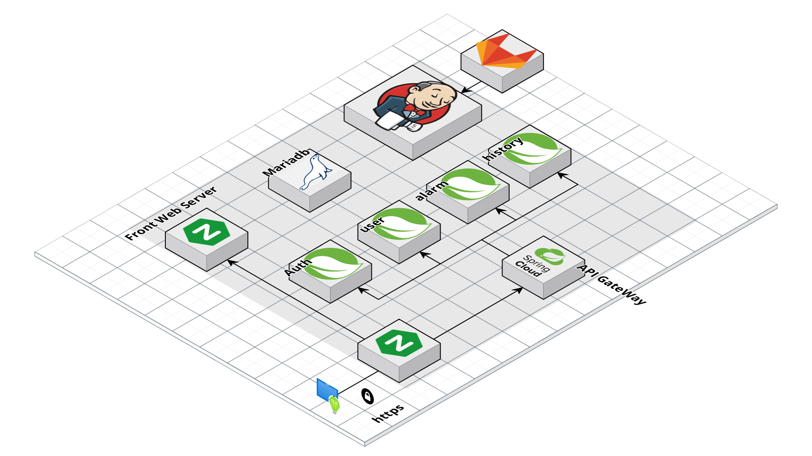

# Architecture

## Diagram

## Technology Stack

- JVM
  - Mono 서버 : Java 11
  - MSA 서버 : Java 11

- 웹서버
    - nginx version : nginx/1.22.1

- IDE 버전
    - IntelliJ IDEA 2022.3.1 (Ultimate Edition)

- WAS
    - Mono 서버 : Spring Boot 2.7.9 8080
    - Gateway 서버 : Spring Boot 2.7.9 8081
    - Auth 서버 : Spring Boot 2.7.9 8082
    - Member 서버 : Spring Boot 2.7.9 8083
    - Alarm 서버 : Spring Boot 2.7.9 8084
    - History 서버 : Spring Boot 2.7.9 8085

- Frontend
    - JavaScript
    - Html
    - CSS

- Backend
    - Java 11
    - Spring boot 2.7.9
    - Spring Web
    - Spring Cloud Gateway
    - Spring Security
    - Spring boot Mail
    - Lombook
    - Spring Data JPA
    - Spring boot Validation
    - OkHttp
    - Firebase
    - CoolSMS
    - MariaDB
    - tomcat
    - netty

- CI/CD & Server
    - Docker
    - Docker-Compose
    - Jenkins
    - Nginx